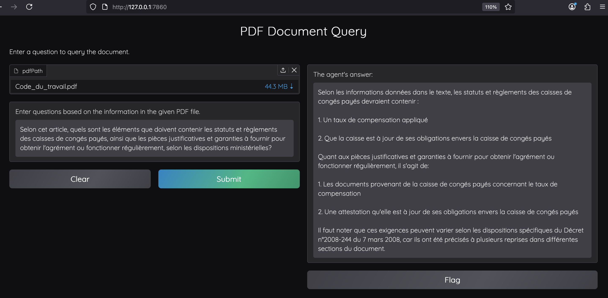

# Generative AI Experiments

Generative AI encompasses computational techniques designed to generate original content such as text, images, or audio, derived from training data. The advent of technologies like Deepseek, MetaAI, and Mistral AI is reshaping professional and communicative practices globally. These systems are not only tools for creative endeavours, such as authorship replication or illustrative recreation, but also valuable assistants in practical tasks, including question-and-answer functions.

This repository contains experiments of implementing different models, libraries, and applications within generative AI to identify optimal technologies across diverse domains and scenarios. Each subdirectory provides detailed insights into specific systems, encompassing their operational workflows, libraries, source code, and experimental results.

These applications are built to leverage Large Language Models (LLMs) locally:

1. [PDF LangChain RAG system](https://github.com/tantikristanti/Generative-AI-LLMs-Experiments/tree/main/rag-multi-docs-langchain-gradio) is a simple PDF RAG system built using LangChain.
2. [PDF Llama-Index RAG system](https://github.com/tantikristanti/Generative-AI-LLMs-Experiments/tree/main/rag-multi-docs-llama-index-gradio) is a simple PDF RAG system built using Llama-Index.
3. [Multi docs LangChain RAG system](https://github.com/tantikristanti/Generative-AI-LLMs-Experiments/tree/main/rag-multi-docs-langchain-gradio) is a multi documents RAG system built using LangChain.
4. [Multi docs Llama-Index RAG system](https://github.com/tantikristanti/Generative-AI-LLMs-Experiments/tree/main/rag-multi-docs-llama-index-gradio) is a multi documents RAG system built using Llama-Index.

---

## Demonstration

The demonstration can be accessed online in [HF-Kristanti-Space](https://huggingface.co/spaces/kristanti/simple-pdf-rag)




---

## Prerequisites

- Python 3.8 or higher
- pip
- `uv`: a Python package manager written in Rust

## Clone the repository

```bash
git clone https://github.com/tantikristanti/Generative-AI-LLMs-Experiments.git

cd Generative-AI-LLMs-Experiments
```
