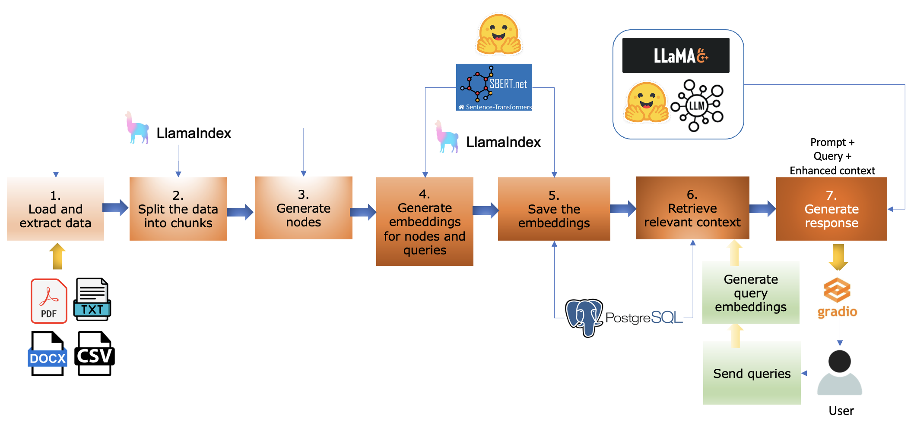
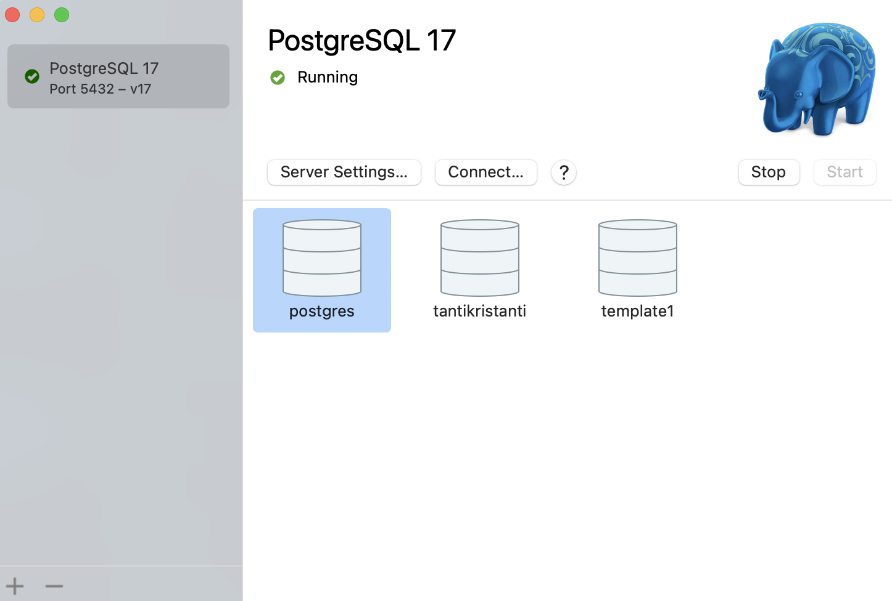
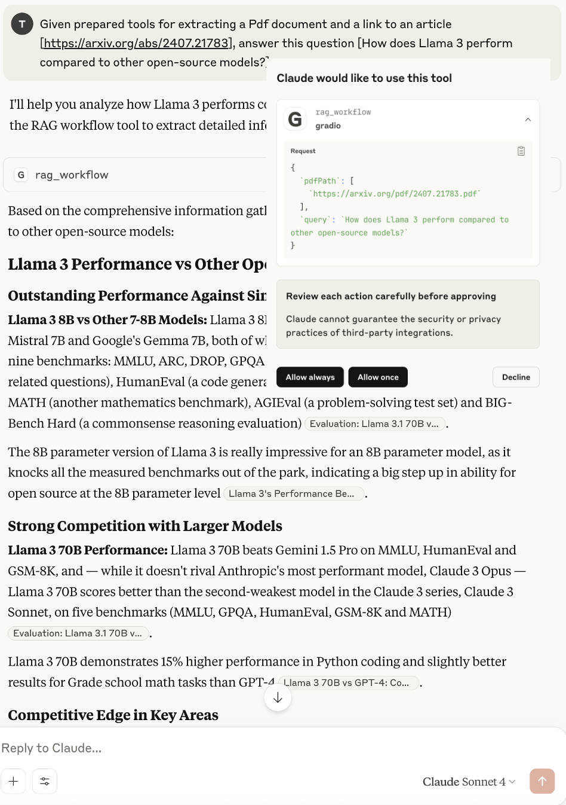
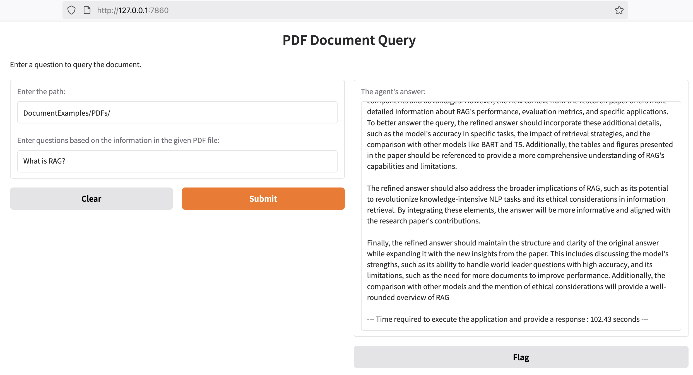
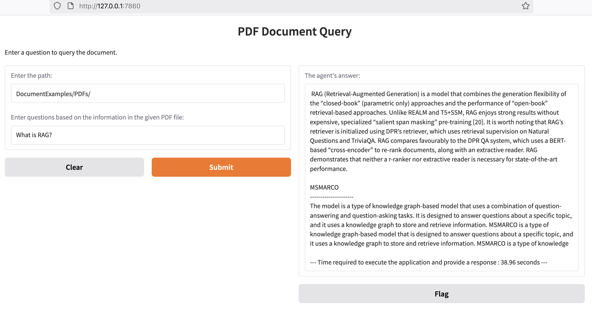
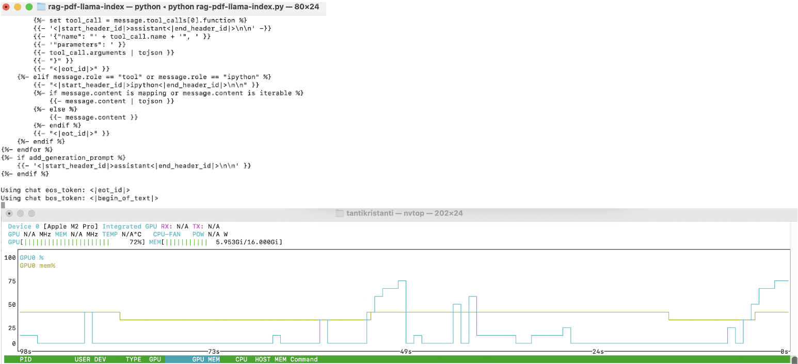
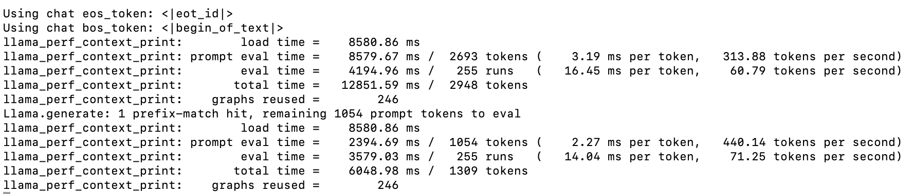
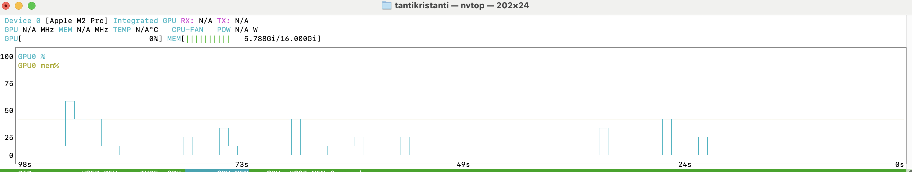

# Multi-Document LLM-Based RAG - (Version 2)

## Introduction

Large language models (LLMs), such as GPT or Llama, excel in generating responses that mimic human communication. They achieve state-of-the-art performance on many Natural Language Processing (NLP) tasks. However, they struggle with constantly changing information. LLMs are pre-trained on static datasets and often give outdated or incomplete answers, especially in decision-making contexts where accuracy is crucial.

Retrieval Augmented Generation (RAG) addresses these issues by retrieving relevant information from external sources, such as websites, databases, or files (e.g., PDFs and CSVs). RAG enhances the reliability of generative AI systems in fields that require real-time data and specialized expertise.

This repository presents an example of a RAG system that integrates various document types (CSV, TXT, DOCX, PDF) as a knowledge base using LlamaIndex, PostgreSQL, LLaMA.cpp, Sentence Transformers models on the Hugging Face Hub, and Gradio. The implemented code is sourced and adapted from the official documentation of the Generative AI-based technology used in this example, which can be accessed in the [References](#references) section.

---

## RAG System

RAG is a hybrid approach that enhances LLMs by integrating external knowledge sources during the generation process. RAG models integrate two NLP components: Information Retrieval (IR) and Natural Language Generation (NLG).

By combining external data retrieval with advanced text generation techniques, these models enhance the accuracy and relevance of AI-generated outputs based on current knowledge. This integration ensures that AI responses are not only accurate but also factually grounded information, significantly reducing the risk of producing hallucinations.

---

## RAG Workflow

The RAG process in this example is structured into the following key steps:



1. Load and extract data

The workflow begins with acquiring relevant and domain-specific raw data from PDFs, which forms the basis for the knowledge base.

2. Split the data into chunks

The collected and extracted data is then segmented into manageable and meaningful chunks of data. This segmentation is important for ensuring the efficiency of the retrieval process.

3. Generate nodes

The text chunks and their corresponding metadata are converted into nodes. The nodes have relationship  information with other nodes and index structures.

4. Generate embeddings

Each node of data is then transformed into embeddings using embedding models. These vector representations capture the semantic meaning of the text, enabling efficient similarity-based retrieval.

5. Save the embeddings

The vector representations are stored in a Vector Store, which is a specialized indexed database designed to facilitate rapid retrieval based on similarity metrics.

6. Retrieve the relevant context

When end-users pose queries to the system, it is converted into vector representations. The *Retriever* component then searches within the Vector Store to identify and retrieve the most relevant segments of text based on semantic similarity.

7. Generate response

The final step involves feeding these enriched prompts, including the user’s query and retrieved information, into LLMs to generate a coherent, fluent, and factually accurate response.

---

## Tools

### Prerequisites

- Python 3.8 or higher
- pip
- `uv`: a Python package manager written in Rust

1. [llama.cpp](https://github.com/ggml-org/llama.cpp)

Install [llama.cpp](https://github.com/ggml-org/llama.cpp) using brew.

```bash
brew install llama.cpp
```

2. Install Hugging Face Hub with CLI extension

Hugging Face Hub with CLI extension is used to download models from Hugging Face Spaces. It can be installed using pip.

```bash
pip install -U "huggingface_hub[cli]"
```

3. LLMs installed locally

Different `llama.cpp-compatible models` can be downloaded from [Hugging Face](https://huggingface.co/models?library=gguf&sort=trending) or other model hosting sites, such as [ModelScope](https://modelscope.cn/).

For example, to load and save [Llama-3.2-1B-Instruct-Q4_K_M.gguf](https://huggingface.co/bartowski/Llama-3.2-1B-Instruct-GGUF/blob/main/Llama-3.2-1B-Instruct-Q4_K_M.gguf) as the LLM locally:

a. Download the model from Hugging Face, either download it manually or use `llama-cli`:

```bash
llama-cli -hf [LLM]
```

b. Test the model

```bash
llama-cli -m [model.gguf]
```

For example:

```bash
llama-cli -m Llama-3.2-1B-Instruct-Q4_K_M.gguf
```

4. [LlamaIndex](https://www.llamaindex.ai/)

Install [LlamaIndex](https://docs.llamaindex.ai/en/stable/getting_started/installation/) using pip

```bash
pip install llama-index
```

5. Pre-trained embedding models

Hugging Face proposes various embedding models that can be found [here](https://huggingface.co/models?other=embeddings).

For example, download and save locally the Hugging Face embedding model for Sentence Transformers [bge-small-en-v1.5](https://huggingface.co/BAAI/bge-small-en-v1.5)

a. Download the model using the `hf-cli`

```bash
hf download BAAI/bge-small-en-v1.5
```

b. List the downloaded model

```bash
ls .cache/huggingface/hub/
```

c. OR clone the directory

```bash
git clone https://huggingface.co/BAAI/bge-small-en-v1.5
```

6. Embedding database

LlamaIndex supports different embedding databases or vector stores (e.g., Chroma, PostgreSQL), and the list can be found [here](https://docs.llamaindex.ai/en/stable/module_guides/storing/vector_stores/).

Installing [PostgreSQL](https://www.postgresql.org/) on MAC can be done in several ways:

a. Using Homebrew

```bash
brew install postgresql 
```

> Start the service

```bash
brew services start postgresql
```

> To check if the service is running

```bash
lsof -i tcp:5432
```

> To stop the service

```bash
brew services stop postgresql 
```

> Configure the Postgres server by creating users with privileges on the database server.

For example, create a new user called **newuser** with the password **newuser** that will have the privileges to create and manage databases.

```bash
psql postgres 

postgres=# CREATE ROLE newuser WITH LOGIN PASSWORD 'newuser';

postgres=# ALTER ROLE newuser CREATEDB;
```

> Quit the current session and then reconnect with the new user’s credentials

```bash
postgres=# \q
psql postgres -U newuser
```

> List the users

```bash
postgres=# \du
```

> To drop the users

```bash
DROP USER [user]
```

b. Install [Postgres.app](https://postgresapp.com/)



Or, install the [PGAdmin](https://www.pgadmin.org/) Management Tool, which is a web-based interactive client available for Postgres to manage the database server.

7. Install a library for saving and searching vector similarity for Postgres vector store [pgvector](https://github.com/pgvector/pgvector) using Homebrew.

```bash
brew install pgvector
```

8. Install [Gradio](https://www.gradio.app/) using pip

---

## Quick Start

```bash
cd rag-multi-docs-llama-index-gradio
```

### Initialize a Project and Set Up the Environment

1. Initialize a project

```bash
uv init
```

2. Create a virtual environment and activate it

```bash
uv venv

source .venv/bin/activate
```

3. Install the necessary dependencies

```bash
uv add -r requirements.txt
```

4. Create environment variables composed of:

```bash
MODEL_PATH=[the_LLM]
EMBEDDING_PATH=[the_embedding_model]
CHUNK_SIZE=[the_chunk_size]
CHUNK_OVERLAP=[the_chunk_overlap_size]
DB_NAME=[the_database_name]
DB_TYPE='postgres'
HOST='localhost'
USER=[the_user_name] 
PASSWORD=[the_password]
PORT='5432'
TABLE_NAME=[the_table_name]
EMBED_DIM=[the_embedding_size]
```

### Running the Application

To run the application, simply type the following command:

```bash
python rag-multi-docs-llama-index.py
```

---

### Results

The running application is listening on localhost, port 7860: **http://localhost:7860**

This application can be run as a local MCP server and called by various MCP clients, such as Gradio and Claude Desktop. For example, the following demonstration shows the server being called by a Claude Desktop client.



### Execution time

Using this article [Retrieval-Augmented Generation for Knowledge-Intensive NLP Tasks](https://proceedings.neurips.cc/paper_files/paper/2020/file/6b493230205f780e1bc26945df7481e5-Paper.pdf) (912 KB, 16 pages) as a knowledge base and using `deepseek-r1` as the LLM and `all-MiniLM-L6-v2` as the embedding model, the process took about 102 seconds, including document ingestion, query result retrieval, and response generation cycles.



Based on this initial process, experimental results across various scenarios show that processing time is affected by data volume, embedding model, and LLM selection. For example, using `Llama3.2` as the LLM and `all-MiniLM-L6-v2` as the embedding model for the same document resulted in a shorter processing time of only 39 seconds.



The response of enhanced context was generated by LLMs running locally via LLaMA.cpp on a 16GB MacBook M2 Pro.

By monitoring the application while it is running using [nvtop](https://github.com/Syllo/nvtop), it can be seen from the image that LLaMA.cpp allocates the GPU resources when calling LLM. After completion, the memory is returned to the CPU.

> When LLaMA.cpp runs the model





> After LLaMA.cpp stops running the model



## References

[1] [Developing Retrieval Augmented Generation (RAG) based LLM Systems from PDFs: An Experience Report](https://arxiv.org/abs/2410.15944)

[2] [Retrieval-Augmented Generation for Knowledge-Intensive NLP Tasks](https://arxiv.org/abs/2005.11401)

[3] [Building RAG from Scratch (Open-source only!)](https://docs.llamaindex.ai/en/stable/examples/low_level/oss_ingestion_retrieval/)

[4] [LlamaIndex Documentation](https://docs.llamaindex.ai/en/stable/)

[5] [LlamaIndex Readers Integration: File](https://llamahub.ai/l/readers/llama-index-readers-file?from=)

[6] [Setting up a PostgreSQL Database on Mac](https://www.sqlshack.com/setting-up-a-postgresql-database-on-mac/)

[7] [SentenceTransformers Documentation](https://sbert.net/)

[8] [LLaMA.cpp Documentation](https://llama-cpp-python.readthedocs.io/en/latest/)

[9] [Hugging Face Spaces](https://huggingface.co/spaces)

[10] [pgvector](https://github.com/pgvector/pgvector)

[11] [Gradio Documentation](https://www.gradio.app/docs)
