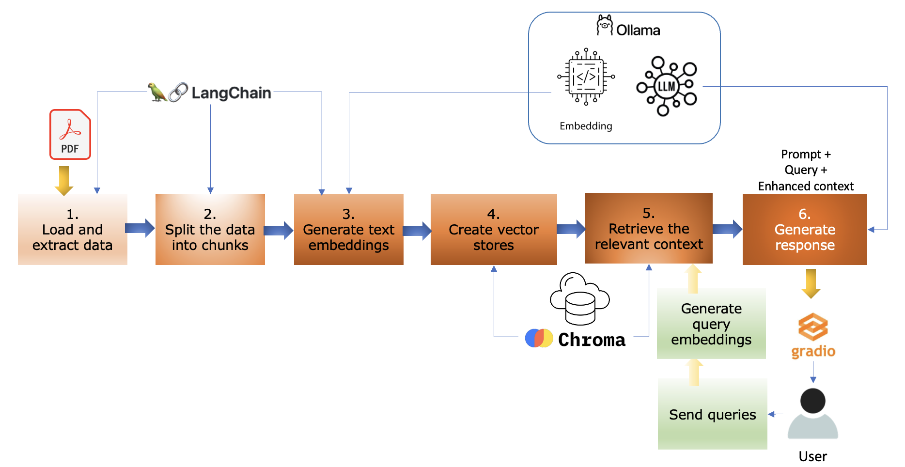
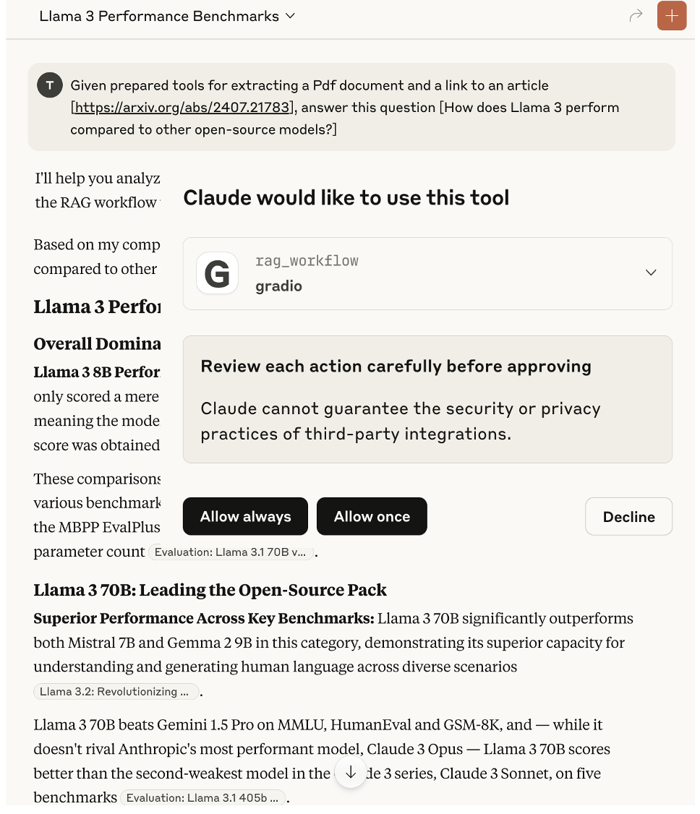
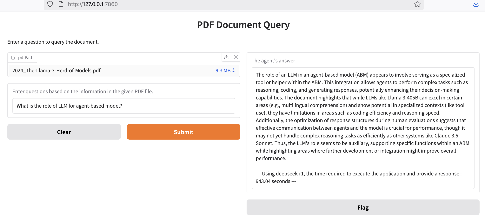
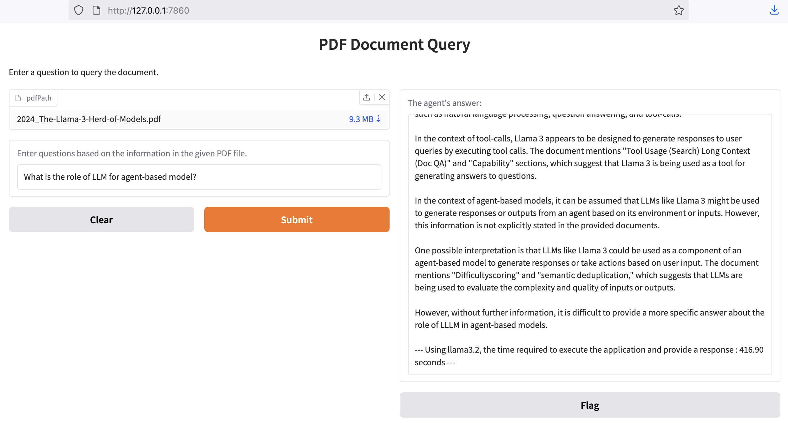
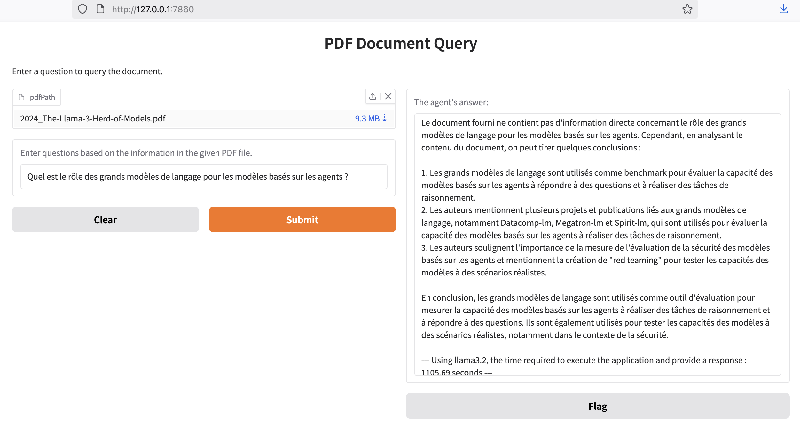
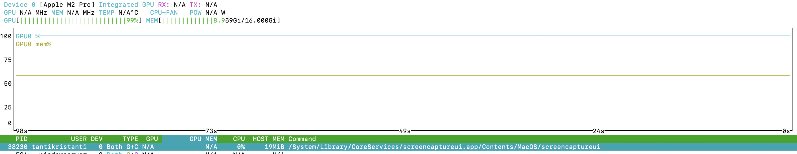
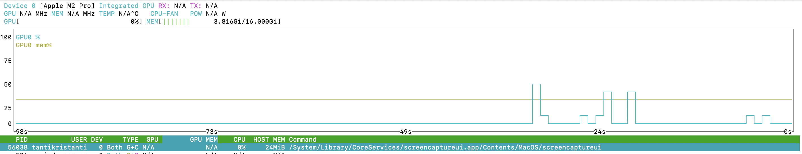

# LLM-Based RAG using PDFs as Knowledge Base - (Version 1)

## Introduction

Large language models (LLMs), such as GPT or Llama, excel in generating responses that mimic human communication. They achieve state-of-the-art performance on many Natural Language Processing (NLP) tasks. However, they struggle with constantly changing information. LLMs are pre-trained on static datasets and often give outdated or incomplete answers, especially in decision-making contexts where accuracy is crucial.

Retrieval Augmented Generation (RAG) addresses these issues by retrieving relevant information from external sources, such as websites, databases, or files (e.g., PDFs and CSVs). RAG enhances the reliability of generative AI systems in fields that require real-time data and specialized expertise.

This repository presents an example of an RAG system that integrates PDF documents as a knowledge base using LangChain, Chroma, Ollama, and Gradio. The implemented codes are sourced and adapted from the official documentation of Generative AI-based technology used in this example, accessible in the [References](#references) section.

---

## RAG System

RAG is a hybrid approach that enhances LLMs by integrating external knowledge sources during the generation process. RAG models integrate two NLP components: Information Retrieval (IR) and Natural Language Generation (NLG).

By combining external data retrieval with advanced text generation techniques, these models enhance the accuracy and relevance of AI-generated outputs based on current knowledge. This integration ensures that AI responses are not only accurate but also factually grounded, significantly reducing the risk of producing hallucinations.

---

## RAG Workflow

The RAG process in this example is structured into the following key steps:



1. Load and extract data

The workflow begins with acquiring relevant and domain-specific raw data from PDFs, which forms the basis for the knowledge base.

2. Split the data into chunks

The collected and extracted data is then segmented into manageable and meaningful chunks of data. This segmentation is important for ensuring the efficiency of the retrieval process.

3. Generate embeddings

Each chunk of data is then transformed into embeddings using embedding models. These vector representations capture the semantic meaning of the text, enabling efficient similarity-based retrieval.

4. Save the embeddings

The vector representations are stored in a Vector Store, which is a specialized indexed database designed to facilitate rapid retrieval based on similarity metrics.

5. Retrieve the relevant context

When end-users pose queries to the system, it is converted into vector representations. The *Retriever* component then searches within the Vector Store to identify and retrieve the most relevant segments of text based on semantic similarity.

6. Generate response

The final step involves feeding these enriched prompts, including the user’s query and retrieved information, into LLMs to generate a coherent, fluent, and factually accurate response.

---

## Tools

1. [Ollama](https://ollama.com/)
2. [LLMs](https://ollama.com/search) installed locally using Ollama (e.g., Deepseek-r1, Llama3.2).
3. [Langchain](https://www.langchain.com/)
4. [Embedding models](https://ollama.com/blog/embedding-models) (e.g., nomic-embed-text)
5. [ChromaDB](https://github.com/chroma-core/chroma) as the embedding database or the vector store
6. [Gradio](https://www.gradio.app/) or Streamlit(https://streamlit.io/)

---

## Quick Start

```bash
cd rag-pdf-langchain-gradio
```

### Install Ollama and LLMs Locally

1. Install [Ollama](https://ollama.com/download)
2. Install LLMs locally using Ollama

```bash
ollama run [LLM]
```

For installing the LLMs from Hugging Face

```bash
ollama run hf.co[LLM]
```

For example:

```bash
ollama run hf.co/bartowski/Llama-3.2-1B-Instruct-GGUF:Q4_K_M
```

### Initialize a Project and Set Up the Environment

1. Initialize a project

```bash
uv init
```

2. Create a virtual environment and activate it

```bash
uv venv

source .venv/bin/activate
```

3. Install the necessary dependencies

```bash
uv add -r requirements.txt
```

4. Create environment variables composed of:

```bash
MODEL_NAME=[LLM]
EMBEDDING_NAME=[embedding_model]
CHUNK_SIZE=[chunk_size]
CHUNK_OVERLAP=[chunk_overlap_size]
CHROMA_PATH='./chroma_db'
```

### Running the Application

```bash
python rag-pdf-langchain-gradio.py
```

The running application is listening on localhost, port 7860: **http://localhost:7860**

### Results

This application can be run as a local MCP server and called by various MCP clients, such as Gradio and Claude Desktop. For example, the following demonstration shows the server being called by a Claude Desktop client.



### Execution time

Experimental results across various data scenarios demonstrate that processing time is affected by data volume, embedding model, and LLM selection. Improved context response is achieved by LLM running locally through Ollama on a 16GB MacBook M2 Pro.

1. Using this article [The Llama 3 Herd of Models](https://arxiv.org/abs/2407.21783) (9.8 MB, 92 pages) as a knowledge base and using `deepseek-r1` as an embedding model and LLM, the process took about 15 minutes, including document ingestion, query result retrieval, and response generation cycles. Meanwhile, using `Llama3.2` for the same document resulted in a shorter processing time of around 7 minutes.





The response to questions in French on the same document:



2. By using an article [Retrieval-Augmented Generation for Knowledge-Intensive NLP Tasks](https://proceedings.neurips.cc/paper/2020/hash/6b493230205f780e1bc26945df7481e5-Abstract.html) with a much smaller size(890 KB, 16 pages) and using `deepseek-r1` as an embedding model and LLM, the system can provide answers to user questions (in French) within 5 minutes.


By monitoring the application while it is running using `ollama ps` and [nvtop](https://github.com/Syllo/nvtop), it can be seen from the image that Ollama allocates most of the GPU resources when calling LLM. After completion, the memory is returned to the CPU.

> When Ollama runs the model




> After Ollama stops running the model



## References

[1] [Developing Retrieval Augmented Generation (RAG) based LLM Systems from PDFs: An Experience Report](https://arxiv.org/abs/2410.15944)

[2] [Retrieval-Augmented Generation for Knowledge-Intensive NLP Tasks](https://arxiv.org/abs/2005.11401)

[3] [Retrieval Augmented Generation (RAG) Case Study - A Resume Analysis Tool](https://app.readytensor.ai/publications/retrieval-augmented-generation-rag-case-study-a-resume-analysis-tool-g1E903d62F6L)

[4] [DeepSeek R1 RAG Chatbot With Chroma, Ollama, and Gradio](https://www.datacamp.com/tutorial/deepseek-r1-rag)

[5] [LangChain Python API Reference](https://python.langchain.com/api_reference/)

[6] [LangChain Document Loaders](https://python.langchain.com/docs/integrations/document_loaders/)

[7] [LangChain Embedding Models](https://python.langchain.com/docs/integrations/text_embedding/)

[8] [LangChain Vector Stores](https://python.langchain.com/docs/integrations/vectorstores/)

[9] [LangChain Retrievers](https://python.langchain.com/docs/integrations/retrievers/)

[10] [LangChain Chat Models](https://python.langchain.com/docs/integrations/chat/)

[11] [Chroma Documentation](https://docs.trychroma.com/docs/overview/introduction)

[12] [Ollama Python](https://github.com/ollama/ollama-python)

[13] [Gradio Documentation](https://www.gradio.app/docs)
